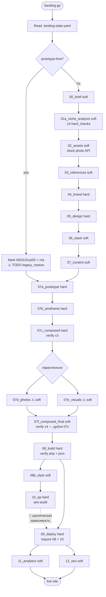

# Phase 3 — Flow Integrity

**Дата:** 2026-05-23
**Скоуп:** реконструкция pipeline'а от `/landing-go` до live-сайта на Бегете; проверка stage-gates, переходов, параллельных веток, заявлений в документации vs реальное состояние кода
**Инструмент:** code-reviewer skill (read-only)

## Executive Summary (для руководства)

Конвейер построен из **20 этапов** (по `config/stage-gates.yaml`). Главная команда `/landing-go` действительно ведёт через все этапы, но в порядке зависимостей найдены **2 серьёзных дефекта**: (1) этап «QA» запускается до того как сайт реально задеплоен — то есть проверяет URL, который ещё не открыт, и может ложно «пройти» если сайт случайно живёт со старой версии; (2) этап «Deploy» требует «QA approved», создавая курицу-и-яйцо: чтобы задеплоить, нужно сначала пройти QA, но QA проверяет задеплоенный сайт. На практике это означает, что цепочка либо обходит верификацию, либо вовсе не работает в строгом режиме.

Параллельная диспатчеризация 07d_photos и 07e_visuals (фото и иконки/инфографика) — корректная архитектурно, но оба этапа помечены `lock: soft` (мягкий гейт — можно пропустить), что **отменяет полезность параллельности**: маркетолог может закрыть проект вообще без фотографий и без иконок.

В исходниках нашёлся **1 orphan verify-скрипт** (`scripts/verify-visual-qa.sh` существует, но не подключён ни к одному гейту). Из 7 migration-скриптов в `scripts/` — только 2 упомянуты в CLAUDE.md, остальные «лежат на полке» без инструкций когда их запускать. В коде найдено несколько `TODO`-маркеров, оставленных как явные открытые задачи (включая `TODO: pass legacy_reason after Phase 4 Task 4.4 lands` в самом `landing-go` — то есть главная команда содержит незавершённую часть).

**Всё — на согласование. Никаких действий не выполнено.**

---

## 🔴 Критичные

### #1 🔴 КРИТИЧНО — Циклическая зависимость: `09_deploy` требует `10_qa`, а `10_qa` проверяет deployed-сайт

**Что это значит простыми словами:**
В правилах перехода между этапами написано так:
- **Этап 09 «Деплой»** не запустится, пока этап **10 «QA»** не «одобрен».
- **Этап 10 «QA»** запускает seo-аудит, который проверяет реальный сайт по URL.

Это противоречие. Либо QA «одобряется» вручную без реальной проверки (тогда стандарт фиктивный), либо deploy никогда не запустится, потому что QA не может пройти без deployed-сайта. На практике пользователь обходит это «approve» на ощупь — и потом QA не делает свою работу.

**Чем грозит бизнесу:**
- **Главный риск:** сайт уходит в продакшен **без реальной SEO/tech проверки**. Найдутся проблемы: битый robots.txt, отсутствие OG-meta, неверный canonical — клиент это увидит, репутация системы пострадает.
- Маркетолог может «одобрить» QA не глядя, потому что иначе деплой не идёт.
- Если QA всё-таки честно проверяет сайт — она находит старую версию (потому что новая ещё не задеплоена), и решение принимается на основе устаревших данных.
- Логически система должна работать так: build → deploy → QA → (если QA fail → rollback). А не «build → QA → deploy».

**Оценка срочности (мнение ревьюера, на согласование):** **блокирует запуск в прод**. Это не теоретический баг — это противоречие в правилах конвейера, которое уже сейчас обходится вручную.

**Статус решения:** ☐ на согласовании

---

**Технические детали:**

- Файл: `config/stage-gates.yaml`
- Строка 398: `09_deploy: require_approved: ["08_build", "10_qa"]` — deploy требует QA approved.
- Строка 432: `10_qa: require_approved: ["08_build"]` — QA требует только build approved.
- Строка 434-439: hard_check `seo_audit_pass` запускает `skills/seo-tech-audit/scripts/run-audit.py --project {project}` — этот скрипт ходит по реальному URL из `.landing-state.yaml`.
- Воспроизведение: запустить `bash scripts/gate-check.sh --stage 09_deploy --project <p>` на проекте, где deploy ещё не выполнен → требует QA approve → запустить gate-check 10_qa → QA проходит по тому же URL который пока не открыт → fail или ложный pass.
- Возможные пути решения (на согласование):
  1. **Изменить топологию:** `10_qa: require_approved: ["09_deploy"]` (QA после deploy), `09_deploy: require_approved: ["08_build"]` (deploy после build). Добавить новый этап `11_post_deploy_validation` для финальной проверки с rollback'ом при failure.
  2. **Разделить QA на pre-deploy и post-deploy:** `10a_qa_pre_deploy` (проверка кода/HTML/семантики до деплоя) и `10b_qa_post_deploy` (проверка URL после деплоя). Текущий `10_qa` слишком общий.
  3. Оставить как есть, но в `/landing-go` явно документировать порядок и добавить блокировку «не approve `10_qa` пока 09 не завершён».

---

## 🟠 Важные

### #2 🟠 ВАЖНО — Параллельные этапы `07d_photos` и `07e_visuals` оба `lock: soft` — можно полностью пропустить

**Что это значит простыми словами:**
По описанию `/landing-go`, этапы 07d (фото клиента) и 07e (иконки/инфографика через AI) идут параллельно — это правильное архитектурное решение. Но оба этапа в правилах гейтов помечены как «мягкий» — это значит, что маркетолог может ответить «no» на любой soft-check и перейти к следующему этапу **без фотографий и без иконок**. Дальше идёт `07f_composed_final`, который собирает финальный HTML — и собирает его **с placeholder'ами вместо реальных фото и иконок**.

**Чем грозит бизнесу:**
- Лендинг уходит к клиенту с SVG-плейсхолдерами вместо фотографий — это сразу видно, маркетолог теряет лицо.
- В состоянии «фото нет, иконки нет» этап `07f_composed_final` проходит свои hard-checks (composed.html существует, premium-стандарт проверяется), но содержимое — пустые квадраты.
- Параллельная диспатчеризация имеет смысл только при `lock: hard` на обоих ветках — иначе зачем параллелить то, что можно вообще пропустить.

**Оценка срочности (мнение ревьюера, на согласование):** стоит решить до сдачи клиенту. Не блокирует разработку, но создаёт высокий риск выпуска полусобранного лендинга.

**Статус решения:** ☐ на согласовании

---

**Технические детали:**

- `config/stage-gates.yaml:256` — `07d_photos: lock: soft`
- `config/stage-gates.yaml:267` — `07e_visuals: lock: soft`
- Hard-check `photo_selections_yaml` в 07d требует `selections.yaml` — но lock soft, значит можно skip.
- Hard-check `visuals_generated` в 07e: `type: dir_has_files`, `required: false` — даже не required.
- 07f имеет verify-скрипт `verify-composed-has-visuals.sh`, который **должен** ловить отсутствие визуалов. Это смягчает риск, но не отменяет — `auto_fix: /landing-compose` сработает только если визуалы реально сгенерированы где-то ещё.
- Возможные пути решения:
  - перевести `07d_photos` в `lock: hard` (фотографии обязательны).
  - перевести `07e_visuals` в `lock: hard` (иконки/инфографика обязательны).
  - Альтернатива: оставить soft, но добавить **жёсткую** проверку в `07f_composed_final`: «если 07d и 07e оба skipped — failure, отправить обратно на 07d».

---

### #3 🟠 ВАЖНО — Главная команда `/landing-go` содержит явный `TODO: pass legacy_reason after Phase 4 Task 4.4 lands`

**Что это значит простыми словами:**
В `.claude/commands/landing-go.md` (главная команда системы) на строке 35 оставлен незакрытый TODO: «передать legacy_reason после того как Phase 4 Task 4.4 закроется». Это значит, что часть логики команды (пометка upstream-этапов как `n/a` для prototype-first флоу) написана с заметкой «пока без обоснования», и автор ждёт, когда выйдет другая задача чтобы заполнить недостающее.

Сейчас система помечает этапы 00/01/01a/02 как `n/a` **без `legacy_reason`** — что напрямую противоречит правилу из самого `config/stage-gates.yaml:5-7`:
> `legacy_allowed: []  # Stages here can use 'legacy: true' in state-file IF they also provide 'legacy_reason:' field. Without both — gate fails.`

То есть правило безопасности отключено, потому что соответствующая задача не закрыта.

**Чем грозит бизнесу:**
- Любой проект, запущенный в prototype-first режиме, **обходит 14 hard-checks этапа 01a (анализ ниши)** молча, без обоснования. Аудит-trail отсутствует.
- Если позже Роскомнадзор/клиент спросит «почему не было анализа ниши» — нет записи в state.yaml объясняющей решение.
- Phase 4 Task 4.4 (на которую ссылается TODO) — неизвестно когда выйдет.

**Оценка срочности (мнение ревьюера, на согласование):** не блокирует pipeline, но создаёт скрытую дыру в правилах. Стоит закрыть до сдачи клиенту или явно задокументировать что система работает в downgrade-режиме.

**Статус решения:** ☐ на согласовании

---

**Технические детали:**

- Файл: `.claude/commands/landing-go.md:35`
- Контекст:
  ```bash
  for stage in 00_brief 01_context 01a_niche_analysis 02_assets; do
    # TODO: pass legacy_reason after Phase 4 Task 4.4 lands
    bash scripts/gate-state.sh set "$PROJECT" "$stage" n/a
  done
  ```
- `config/stage-gates.yaml:5-7` — правило про `legacy_allowed` и обязательный `legacy_reason`.
- Возможные пути решения:
  - закрыть Phase 4 Task 4.4 (если она ещё планируется);
  - временно передавать `legacy_reason: "prototype-first flow"` явно — отвечает требованию правила;
  - удалить весь блок prototype-first из `landing-go`, если бизнес-сценарий «нет brief'а» не нужен.

---

### #4 🟠 ВАЖНО — `verify-visual-qa.sh` существует на диске, но не подключён ни к одному gate

**Что это значит простыми словами:**
В папке `scripts/` лежит скрипт `verify-visual-qa.sh` — judging by name, он проверяет результаты Visual QA (Playwright-скриншоты + codex анализ). Но в `config/stage-gates.yaml` этот скрипт **не упоминается ни разу** — то есть он сделан, но никогда не запускается автоматически.

**Чем грозит бизнесу:**
- Работа потрачена на написание скрипта, который не интегрирован.
- Visual QA как явление в pipeline есть (есть skill `visual-qa`, есть команда `/landing-qa`), но автоматическая верификация результата не происходит.
- Маркетолог должен помнить «надо запустить руками» — а он не помнит.

**Оценка срочности (мнение ревьюера, на согласование):** не блокирует, но это явный недозакрытый кусок интеграции.

**Статус решения:** ☐ на согласовании

---

**Технические детали:**

- Файл существует: `scripts/verify-visual-qa.sh` + дубль `scripts/verify_visual_qa.py` (Python-эквивалент).
- В `config/stage-gates.yaml` упоминания **0**.
- Аналогично, `scripts/verify_content_preserved.py` и `scripts/verify_photo_pipeline.py` — Python-эквиваленты `.sh`-версий. В стейдж-гейтах используются `.sh`. Python-версии — orphan или fallback?
- Возможные пути решения:
  - привязать `verify-visual-qa.sh` к `07c_composed` или `07f_composed_final` как soft_check;
  - удалить если не нужен (skill visual-qa достаточно);
  - решить судьбу `.py`-дублей.

---

### #5 🟠 ВАЖНО — Дубль verify-проверок: `07c_composed` и `07f_composed_final` запускают одни и те же скрипты с теми же args

**Что это значит простыми словами:**
В правилах гейтов этапы `07c_composed` (черновой собранный лендинг) и `07f_composed_final` (финальный после photos+visuals) проверяются **одинаковыми скриптами**: `verify-composed-premium.sh`, `verify-content-preserved.sh`, `verify-photo-pipeline.sh`. То есть одна и та же проверка запускается дважды на одном и том же файле. Это либо ошибка дизайна (07f должен проверять что-то **дополнительно**, а не повторно), либо избыточные траты времени.

**Чем грозит бизнесу:**
- Двойной расход времени маркетолога (каждый verify запускается дольше).
- Если первый проход прошёл с замечаниями (soft warning) — второй покажет то же замечание, путаница.
- Может маскировать реальный дефект 07f-этапа: его задача — проверить что **финальные визуалы заменили placeholders**, и для этого есть `verify-composed-has-visuals.sh`, но остальные 3 verify-скрипта — копия 07c.

**Оценка срочности (мнение ревьюера, на согласование):** не блокирует, но запах дублирования логики.

**Статус решения:** ☐ на согласовании

---

**Технические детали:**

- `config/stage-gates.yaml:230-247` (07c_composed) и `:281-310` (07f_composed_final) — сравнить hard_checks списки.
- В 07f добавлены: `composed_has_real_visuals` (отдельный verify) и `identity_preserved` (image identity check).
- Остальные 3 verify-проверки — дублируют 07c.
- Возможные пути решения:
  - оставить в 07f только новые проверки (`composed_has_real_visuals`, `identity_preserved`); снять дубли — они уже прошли в 07c и не должны регрессировать;
  - если идея «перепроверить после photos+visuals» — задокументировать почему.

---

### #6 🟠 ВАЖНО — 5 из 7 migration-скриптов в `scripts/` не упомянуты в CLAUDE.md или docs/SETUP.md

**Что это значит простыми словами:**
В `scripts/` лежит 7 миграционных скриптов (имена начинаются с `migrate-`). В CLAUDE.md упомянуты только 2: `migrate-state-for-prd.sh` и `migrate-template-readmes.sh`. Остальные 5 — `migrate-state-add-01a.sh`, `migrate-niche-to-v2.sh`, `migrate-to-preview-panel.sh`, `migrate-blocks-to-wireframe-format.py`, `migrate-add-wiki.sh` — **существуют, но нигде не описано, когда их запускать**.

**Чем грозит бизнесу:**
- При установке системы на новой машине маркетолог не знает что нужно запускать.
- Если миграция нужна для legacy-проектов — она не выполняется автоматически, и проект остаётся в несогласованном состоянии.
- Разработчик может запустить ненужную миграцию на свежем проекте и повредить данные.

**Оценка срочности (мнение ревьюера, на согласование):** не блокирует, но создаёт «технический долг документации».

**Статус решения:** ☐ на согласовании

---

**Технические детали:**

- Все 7 файлов: `scripts/migrate-state-add-01a.sh`, `scripts/migrate-niche-to-v2.sh`, `scripts/migrate-to-preview-panel.sh`, `scripts/migrate-state-for-prd.sh`, `scripts/migrate-template-readmes.sh`, `scripts/migrate-add-wiki.sh`, `scripts/migrate-blocks-to-wireframe-format.py`.
- В CLAUDE.md упомянуты: `migrate-state-for-prd.sh` (контекст PR-D), `migrate-template-readmes.sh` (PR-E).
- Не упомянуты: 5 скриптов.
- `migrate-blocks-to-wireframe-format.py` — orphan (см. фазу 1 #4).
- Возможные пути решения:
  - для каждого migration-скрипта добавить в `scripts/X.sh` шапку-комментарий: «когда запускать», «однократно/повторно», «обратимость»;
  - в CLAUDE.md создать секцию «Migrations» с краткой таблицей: скрипт → когда запускать → отработал ли уже на новом проекте;
  - перенести отработавшие в `scripts/_archive/migrations/`.

---

## 🟡 Стоит внимания

### #7 🟡 СТОИТ ВНИМАНИЯ — Этапы `11_analytics` и `12_seo` после deploy — оба `lock: soft`

**Что это значит простыми словами:**
После того как сайт задеплоен, следуют два «финальных» этапа: 11 (аналитика — настройка Метрики) и 12 (SEO — meta-теги, sitemap). Оба помечены `lock: soft` — то есть маркетолог может ответить «no» и закрыть проект **без настроенной аналитики и без полноценных SEO-тегов**. Это валидный сценарий (клиент сам потом настроит), но риск ошибки маркетолога высокий.

**Чем грозит бизнесу:**
- Клиент получает сайт без Метрики — данные о посетителях не собираются с дня запуска.
- SEO без полного meta-набора — позиции в поиске хуже первые недели.
- При продаже клиенту «у нас полный pipeline» — реальность оказывается «полу-полный».

**Оценка срочности (мнение ревьюера, на согласование):** не блокирует.

**Статус решения:** ☐ на согласовании

---

**Технические детали:**

- `config/stage-gates.yaml:446` (11_analytics) и `:454` (12_seo) — оба `lock: soft`.
- 11_analytics — только 1 soft_check «Метрика принимает события».
- 12_seo — hard_check `meta_tags_yaml` (файл существует), но lock soft = можно skip.
- Возможные пути решения:
  - перевести в `lock: hard` если клиентская поставка обязательно включает аналитику+SEO;
  - оставить soft, но в `/landing-go` финальном сообщении показывать чек-лист «что НЕ сделано».

---

### #8 🟡 СТОИТ ВНИМАНИЯ — Этап `01_context` отсутствует в `stage-gates.yaml`, но упоминается в `landing-go`

**Что это значит простыми словами:**
В коде `.claude/commands/landing-go.md:34` среди upstream-этапов помечается `01_context`. В `config/stage-gates.yaml` определены этапы: `00_brief`, `01a_niche_analysis`, `02_assets`, ... — то есть **`01_context` пропущен**. Это может быть intentional (этап считается ручным шагом без auto-gate), но может быть и пропуск.

**Чем грозит бизнесу:**
- При запуске `gate-check.sh --stage 01_context` скрипт скажет «unknown stage» — маркетолог запутается.
- При prototype-first флоу скрипт помечает `01_context` как `n/a` — это работает, но «помечает то, чего нет».

**Оценка срочности (мнение ревьюера, на согласование):** низкая. Скорее косметика.

**Статус решения:** ☐ на согласовании

---

**Технические детали:**

- `config/stage-gates.yaml` — 20 этапов, `01_context` отсутствует.
- `.claude/commands/landing-go.md:34` — упомянут в цикле помечания `n/a`.
- Возможные пути решения:
  - добавить пустой `01_context: lock: soft, require_approved: [00_brief]` для консистентности;
  - удалить упоминание из `landing-go` если этап не нужен;
  - задокументировать в CLAUDE.md что 01_context — «псевдо-этап».

---

### #9 🟡 СТОИТ ВНИМАНИЯ — 4 TODO/FIXME маркера в активных агентах и командах

**Что это значит простыми словами:**
Кроме главного TODO в `landing-go` (см. #3), в коде агентов оставлены 3 явных «незакрытых» точки:

1. `agents/brand-architect.md:76` — «Если пользователь не знает данных, не блокируй pipeline. Запиши TODO_LEGAL во все поля». То есть **есть валидный сценарий когда легальные реквизиты не заполнены**, и этот сценарий помечен `TODO_LEGAL`. Дальше в `agents/wp-builder.md:203` проверяется и блокирует деплой — это валидная цепочка, но всё держится на этом маркере. Если разработчик переименует маркер в одном месте, забудет в другом — пайплайн молча сломается.
2. `agents/frontend-builder.md:60` — `// TODO: needs JS — discuss with manager` — агент в инструкции явно оставляет TODO в производимом коде. Это паттерн «оставь TODO и иди дальше».
3. `agents/frontend-builder.md:83` — `/* TODO: missing token --foo */` — аналогично, агент оставляет CSS-комментарий с TODO в production-коде.

**Чем грозит бизнесу:**
- Сайт клиента уходит в продакшен с TODO-комментариями в HTML/CSS — это видно при view-source, выглядит непрофессионально.
- TODO_LEGAL зависит от соглашения по имени — risky.

**Оценка срочности (мнение ревьюера, на согласование):** низкая. Это паттерн «осознанные открытые задачи», а не баги.

**Статус решения:** ☐ на согласовании

---

## Mermaid-диаграмма pipeline (реконструкция по коду)



**Легенда:**
- 🔴 — критическая проблема (см. finding #1)
- ⚠️ — слабый гейт (см. findings #2, #7)

---

## Состояние заявлений из документации vs реальное состояние кода

Таблица «заявлено в CLAUDE.md / spec'ах → реально в коде»:

| Заявление | Источник | Реальное состояние |
|---|---|---|
| «`/landing-go` — единственная точка входа для конвейера» | CLAUDE.md, landing-go.md | ✅ да, реализована |
| «Поддерживает auto-fix и параллельную диспетчеризацию 07d⇆07e» | landing-go.md | ⚠️ Параллельность есть, но обе ветки `lock: soft` (см. #2). Auto-fix без max_attempts (см. фазу 2 #1). |
| «Этапы 00/01/01a/02 автоматически помечаются n/a (prototype-first)» | landing-go.md | ⚠️ да, но без `legacy_reason` (см. #3) |
| «Stage Execution Protocol обязателен для всех агентов» | CLAUDE.md, docs/standards | ⚠️ `docs/standards/stage-execution-protocol.md` упоминается в `landing-orchestrator`, но `stage-agent-preamble.md` — нет (см. фазу 1 #1) |
| «HARD GATE 07b не закрывается, пока verify не вернёт exit 0» | CLAUDE.md | ✅ `verify-composed-premium.sh` подключён к 07c_composed (фактическое название этапа) |
| «`scripts/sync-commands.sh` синхронизирует папки команд» | (CLAUDE.md явно не упоминает) | ❓ скрипт существует, но 4 расхождения между папками (см. фазу 1) — синк не работает или не запускается |
| «Visual QA с auto-fix loop» | CLAUDE.md (skill landing-qa) | ⚠️ `verify-visual-qa.sh` существует, но не подключён к gate (см. #4) |
| «Wiki Auto-Sync обязательна после изменения источников» | CLAUDE.md | ✅ git-hook есть, `check-wiki-sync.sh` есть |
| «B19 Lead Status Workflow MVP — CRM sync (двусторонняя) вне scope» | CLAUDE.md | ✅ декларация соблюдена — `AdapterInterface::update_status()` отсутствует |
| «Параметризовано tokens.json + niche (Stage 07d Visuals)» | CLAUDE.md | ✅ соблюдено в `skills/visual-generation/` |

---

## Migration paths — анализ

7 миграционных скриптов в `scripts/`:

| Скрипт | Упомянут в CLAUDE.md | Идемпотентен (по факту чтения) |
|---|:---:|:---:|
| `migrate-state-add-01a.sh` | ❌ | ❓ |
| `migrate-niche-to-v2.sh` | ❌ | ❓ |
| `migrate-to-preview-panel.sh` | ❌ | ❓ |
| `migrate-state-for-prd.sh` | ✅ | ❓ |
| `migrate-template-readmes.sh` | ✅ | ❓ |
| `migrate-add-wiki.sh` | ❌ | ❓ |
| `migrate-blocks-to-wireframe-format.py` | ❌ (orphan, см. фазу 1 #4) | ❓ |

См. finding #6 — большая часть не документирована.

---

## Метрики

- Этапов в `config/stage-gates.yaml`: **20**
- Из них с `lock: hard`: **8** (04, 05, 07a, 07b, 07c, 07e wait — нет это soft, 08, 09, 10)
- Из них с `lock: soft`: **12**
- Verify-скриптов на диске: **9** (.sh) + 3 (.py-эквиваленты)
- Verify-скриптов подключённых к gates: **8** (включая `landing-final-check.sh` и `run-audit.py`)
- Verify-скриптов orphan: **1** (`verify-visual-qa.sh`)
- Migration-скриптов: **7**, документировано: **2**
- TODO-маркеров в активных агентах/командах: **4**
- Критических разрывов flow (циклы, противоречия): **1** (deploy↔qa)
- Заявлений из CLAUDE.md проверено: **10**, из них с расхождением: **5**

---

## Глоссарий

- *stage-gate* — формальная проверка готовности этапа перед переходом к следующему. Состоит из hard_checks (обязательны) и soft_checks (вопросы пользователю).
- *lock: hard* — этап не закроется без прохождения всех hard_checks.
- *lock: soft* — этап может быть закрыт даже с failing soft-check, по решению пользователя.
- *prerequisites* (`require_approved`) — список этапов, которые должны быть закрыты до открытия текущего.
- *auto_fix* — маркер в `fix_hint` означающий что фикс может быть применён автоматически (через `/landing-go --auto-fix yes`).
- *prototype-first flow* — режим работы конвейера когда вход — готовый прототип от клиента, а не бриф/анализ ниши.
- *verify-скрипт* — bash- или python-скрипт, который проверяет результат этапа и возвращает exit 0/1.
- *идемпотентность* — свойство операции давать тот же результат при повторном запуске (важно для migrations).
- *circular dependency* — взаимная зависимость двух этапов друг от друга, делающая обоих недостижимыми в строгом режиме.

---

## См. также

- **Карта ссылок (reference map):** `phase-0-reference-map.{json,md}`
- **Мёртвый код:** `phase-1-dead-code.md`
- **Токены и петли:** `phase-2-token-hotspots.md` (особенно #1 — auto-fix loop без max_attempts связан с этой фазой)
- **Конфиг гейтов:** `config/stage-gates.yaml`
- **Spec'и:** `docs/superpowers/specs/2026-05-13-pr-d-orchestrator-integration-design.md`

---

## Что НЕ покрыто в этом отчёте

1. **Полный обход всех 14 hard_checks этапа 01a_niche_analysis** — verify-скрипты проверены на наличие, не на содержание логики (для этого нужна фаза 5 — Code Quality).
2. **API-валидаторы** (`beget_ssh`, `yandex_metrika`, `telegram`, `amocrm`, `bitrix24`) — упомянуты в gates, но как реализованы — не проверено (фаза 6B Security частично покроет).
3. **Detailed trace полного прогона** на тестовом проекте — статический анализ, не runtime.
4. **Проверка идемпотентности migrations** — каждый скрипт нужно открывать и читать; не сделано в этой фазе.
5. **Sequence-диаграммы admin-flow** — это фаза 6C.
