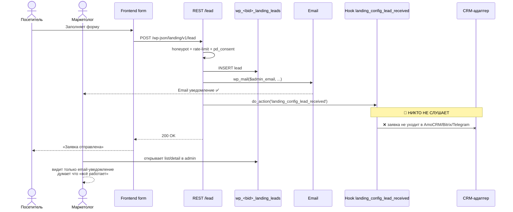
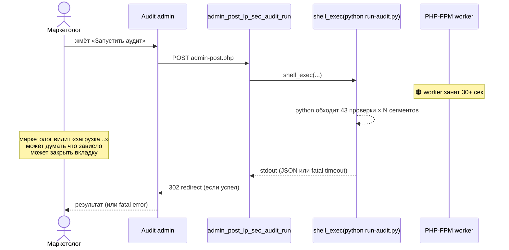
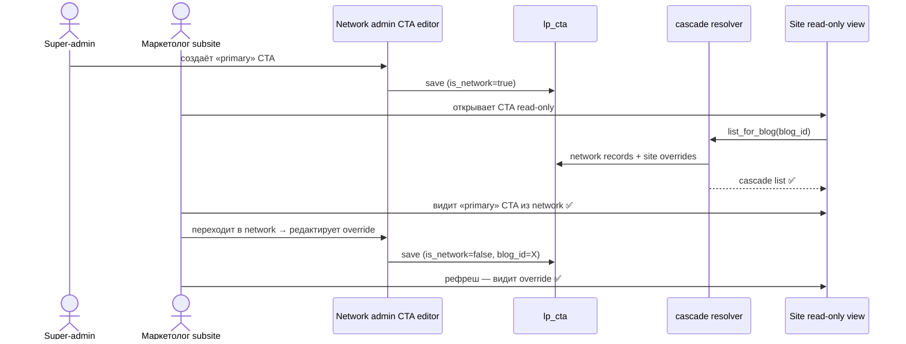

# Phase 6C — WP-admin Flow Coherence

**Дата:** 2026-05-23
**Скоуп:** end-to-end сценарии маркетолога через WP-админку mu-plugin landing-config — от создания сущности (CTA / lead / integration / cookie-banner / SEO settings) до видимого эффекта на subsite/фронте.
**Инструмент:** code-reviewer skill (read-only)

## Executive Summary (для руководства)

Главная находка: **Adapter dispatch для CRM не подключён.** В REST endpoint `/lead` (строка 84) есть `do_action('landing_config_lead_received', $lead_id, $data)`, но **в коде нет ни одного `add_action('landing_config_lead_received')` слушателя**. Это значит: заявка от посетителя пишется в БД ✅, email админу отправляется ✅, но **в CRM (AmoCRM/Bitrix24/HubSpot/Telegram/WhatsApp) — НЕ уходит**. Вся CRM-инфраструктура — 6 адаптеров, encryption ключей, network-admin UI для настройки — **существует и работает в плане UI**, но **в production-flow заявка до CRM не доходит**. Это самый серьёзный gap всего mu-plugin.

В коде есть комментарий-самопризнание: `// Adapter dispatch happens in A5; A1 just stores + emails` (rest-lead.php:83). То есть это **известная незакрытая задача PR A5**, документированная в коде.

Вторая находка: **audit-runner синхронный.** Маркетолог нажимает «Запустить аудит» → PHP делает `shell_exec(python run-audit.py ...)` → страница висит **30+ секунд** пока Python обходит сайт. На медленном хостинге или большом сайте — PHP-FPM worker занят, может уйти в timeout (default 30 сек). Это плохой UX и потенциальная блокировка worker pool'а.

Третья: **нет cleanup hook'а при удалении WP-сайта в multisite.** Per-blog таблицы `wp_<bid>_landing_leads` и `wp_<bid>_landing_lead_status_log` создаются при инсталляции, но при `wpmu_delete_blog` (удаление сайта через network admin) — **не дропаются**. Орфанные таблицы остаются в БД (data leak + bloat).

Положительные находки: **migration markers идемпотентны** (`landing_config_migration_b1_pd_consent`, `landing_config_migration_s2a3_cta` — проверяются через `get_site_option`, повторный run не делает повторных изменений). **`escapeshellarg` правильно применён** в audit-runner (нет command injection). **Lead-detail back-navigation корректна** — после save редирект на правильный URL.

**Всё — на согласование. Никаких действий не выполнено.**

---

## 🔴 Критичные

### #1 🔴 КРИТИЧНО — Adapter dispatch не подключён: заявки НЕ уходят в CRM

**Что это значит простыми словами:**
Цепочка обработки заявки спроектирована так:
1. Посетитель лендинга жмёт «Отправить заявку».
2. Frontend POST → `/wp-json/landing/v1/lead`.
3. REST endpoint: проверяет honeypot, rate-limit, 152-ФЗ consent → **пишет в БД** → **отправляет email админу** → вызывает `do_action('landing_config_lead_received', $lead_id, $data)` — это сигнал «эй, кто слушает, обработайте новую заявку».
4. По дизайну (комментарий в коде): «На этот сигнал отвечает adapter-dispatcher, который читает настройки integration в network admin → выбирает активные CRM → отправляет заявку в каждый».

**Реальность шага 4:** **никто не слушает.** В коде mu-plugin **0 совпадений по `add_action('landing_config_lead_received')`**. Файл `integrations.php` содержит только инфраструктуру (CPT, encrypt/decrypt полей, settings UI), но **функции `dispatch_to_adapter()` / `send_lead()` нет ни в одном адаптере**.

То есть: 6 адаптеров (Email, Telegram, WhatsApp, AmoCRM, Bitrix24, HubSpot), encryption ключей CRM, целая network-admin страница для настройки credentials, шифрование API-ключей в БД — **вся эта инфраструктура работает «в воздух»**: маркетолог настраивает CRM, видит «Сохранено», но реальный поток заявок в CRM не идёт.

**Чем грозит бизнесу:**
- **Клиент платит за систему, заявки в CRM не приходят.** Маркетолог месяц настраивает интеграции, клиент жалуется «лидов нет в AmoCRM», маркетолог разбирается, **обнаруживает что adapter dispatch не работает** — реputational damage.
- **Маркетолог тратит время на бесполезную настройку** — все интеграции (testimonial UI «бот: @имя_бота») показывают что бот рабочий, но реальной отправки нет.
- В CLAUDE.md заявлено что 6 адаптеров работают — это **не соответствует действительности** для production flow.
- Workaround «email админу» (он есть и работает) спасает в моменте, но это не та функциональность, которую клиент ожидает.

**Оценка срочности (мнение ревьюера, на согласование):** **БЛОКИРУЕТ запуск в прод.** Это не баг в код, это **незакрытая задача PR A5**, явно документированная в коде комментарием.

**Статус решения:** ☐ на согласовании

---

**Технические детали:**

- Файл: `rest-lead.php:83-84`:
  ```php
  // Adapter dispatch happens in A5; A1 just stores + emails
  do_action('landing_config_lead_received', $lead_id, $data);
  ```
- Grep по всему mu-plugin: `add_action.*landing_config_lead_received` — **0 матчей**.
- `integrations.php` (131 строка) содержит:
  - Регистрацию CPT `lp_integration` ✅
  - Список адаптеров `VALID_ADAPTERS = ['email', 'telegram', 'whatsapp', 'amocrm', 'bitrix24', 'hubspot']`
  - Helper'ы для encryption/decryption полей
  - НО — **нет** функции которая на `landing_config_lead_received` итерирует enabled-адаптеры и вызывает их `send_lead($data)`.
- Адаптеры в `adapters/*.php` — каждый имеет метод `send(...)` или подобное (требует Read каждого), но **никто их не вызывает на лиды**.
- Возможные пути решения:
  - **Закрыть PR A5:** реализовать `add_action('landing_config_lead_received', __NAMESPACE__.'\\dispatch_to_adapters')` в `integrations.php`. Функция: `list_for_blog('lp_integration')` → для каждой active integration → instantiate adapter → call `send_lead($data)` → log результат.
  - Если PR A5 в roadmap'е — **указать в CLAUDE.md явно**: «Adapter dispatch ещё не реализован, заявки уходят только на email».
  - Если решено не реализовывать — **удалить CRM-адаптеры и network-admin страницу Integrations** (избежать confusion для маркетолога).

---

### #2 🔴 КРИТИЧНО — Per-blog таблицы leads/lead_status_log не чистятся при удалении WP-сайта (data leak в multisite)

**Что это значит простыми словами:**
В multisite каждый subsite (например `russian.ailexi.ru`, `family.ailexi.ru`) имеет свои таблицы заявок: `wp_2_landing_leads`, `wp_3_landing_leads`, `wp_2_landing_lead_status_log` и т.д. Когда super-admin удаляет subsite через Network → Sites → Delete — WP сам сносит большинство wp_2_* таблиц, но **plugin-specific таблицы (как `wp_2_landing_leads`) WP не знает**. Их должен дропать сам плагин через hook `wpmu_delete_blog`.

В коде **0 совпадений по `wpmu_delete_blog`** и `delete_blog`. То есть удалили subsite — таблицы `wp_<bid>_landing_leads` остаются в БД с **полными ПД клиентов** (имена, телефоны, email).

**Чем грозит бизнесу:**
- **152-ФЗ нарушение (статья 5 — целевое использование).** ПД хранятся после прекращения целевого использования.
- **При утечке БД** — старые данные удалённых сайтов в clear.
- **Bloat БД** — каждый удалённый сайт оставляет таблицы навсегда.
- **Юридический риск** при проверке РКН: «у вас в БД данные сайта который удалён 2 года назад — на каком основании?»

**Оценка срочности (мнение ревьюера, на согласование):** стоит решить до сдачи клиенту, особенно если клиент будет создавать/удалять субсайты для разных сегментов.

**Статус решения:** ☐ на согласовании

---

**Технические детали:**

- В `skills/wp-landing-config/mu-plugin/landing-config/includes/db.php` есть `maybe_create_table()` (создание per-blog table), но **нет** `maybe_drop_table()` или подобного.
- Grep по `wpmu_delete_blog` в всём mu-plugin: **0 матчей**.
- Возможные пути решения:
  - добавить в `db.php`: `add_action('wpmu_delete_blog', __NAMESPACE__.'\\drop_blog_tables');` функция `drop_blog_tables($blog_id)` → `DROP TABLE wp_{$blog_id}_landing_leads`, `wp_{$blog_id}_landing_lead_status_log`.
  - предусмотреть **опцию archive vs drop**: возможно админ хочет сохранить данные удалённого сайта в `wp_landing_leads_archive` со ссылкой на blog_id для compliance — это компромисс.

---

## 🟠 Важные

### #3 🟠 ВАЖНО — Audit runner синхронный — `shell_exec(python run-audit.py)` блокирует PHP-FPM worker на 30+ сек

**Что это значит простыми словами:**
Audit dashboard (`Лендинг → Аудит`) имеет кнопку «Запустить». При нажатии:
1. POST на `admin-post.php?action=lp_seo_audit_run`.
2. Handler в `seo-audit/admin-network.php` вызывает функцию из `audit-runner.php`.
3. **`shell_exec(python skill_path/run-audit.py ...)`** — синхронно, страница висит.
4. Python обходит N поддоменов клиента, делает 43 HTTP-проверки на каждый — это легко 30 секунд или больше для multi-site.
5. После завершения — handler парсит JSON output → redirect.

**Проблемы:**
- PHP-FPM worker занят всё это время — другие запросы на сайт могут timeout'нуть.
- Default `max_execution_time = 30` в php.ini — длинный аудит **уйдёт в fatal error** без результата.
- Маркетолог видит «загрузка...» 30 секунд — может думать «зависло», закрыть вкладку → audit отменяется в середине → state inconsistent.

**Чем грозит бизнесу:**
- При запуске аудита для multisite с 10+ сегментами — гарантированный timeout.
- На медленном хостинге Бегет — даже 1 сегмент может не успеть.
- Маркетолог не получает результат, не понимает почему.

**Оценка срочности (мнение ревьюера, на согласование):** стоит решить до production, особенно для клиентов с multisite.

**Статус решения:** ☐ на согласовании

---

**Технические детали:**

- Файл: `seo-audit/audit-runner.php:106` — `$stdout = shell_exec($cmd);`
- escapeshellarg/escapeshellcmd используется корректно ✅ (нет command injection).
- Нет async/job-queue.
- Возможные пути решения:
  - **WP Cron job:** при нажатии «Запустить» — создать `wp_schedule_single_event('lp_run_audit', 0, [...])`, показать пользователю «Аудит запущен, результат через 1-2 минуты, обновите страницу». Cron подхватит и выполнит без блокировки worker'а.
  - **Action Scheduler** (плагин WooCommerce) — более надёжный чем wp_cron.
  - **Background PHP process** через `proc_open(...) + nohup` — сложнее, но bare-bones.
  - временное решение: `set_time_limit(120)` перед `shell_exec` чтобы избежать fatal error — это лечит timeout, но не UX-зависание.

---

### #4 🟠 ВАЖНО — Lead-detail после save редиректит на тот же экран — пользователь не видит «вернуться в список»

**Что это значит простыми словами:**
Маркетолог в списке заявок кликает на заявку #5 → открывается detail-страница → меняет статус → save → **редирект обратно на тот же detail с `?saved=1`**. Это разумный паттерн для «продолжить работу с заявкой». Но **нет кнопки «вернуться в список»** в видимом UI — только маленькая ссылка `$back_url` в header'е страницы (admin-lead-detail.php:41).

Если маркетолог обработал 50 заявок подряд — каждое возвращение в список требует найти ссылку в header'е. Это микро-friction, но накапливается.

**Чем грозит бизнесу:**
- Производительность маркетолога снижается при работе с большим количеством заявок.
- Раздражение → ошибки.

**Оценка срочности (мнение ревьюера, на согласование):** низкая. UX-микро-улучшение.

**Статус решения:** ☐ на согласовании

---

### #5 🟠 ВАЖНО — Cascade flow для CTA/Integrations/Snippets/Lead-statuses требует ручной верификации на multisite — не покрыто тестами

**Что это значит простыми словами:**
S2-A.3 / S2-A.4 (CLAUDE.md) описывают cascade-логику: network admin создаёт default → subsite может override. Каждая из 4 сущностей (CTA, Integrations, Snippets, Lead-statuses) должна корректно работать в обоих направлениях:
- Создание на network → видно как read-only на subsite ✅ (есть read-only views, фаза 6A)
- Создание override на subsite → не затирает network → отображается с пометкой «overridden»
- Удаление override на subsite → возврат к network default

В `cascade.php` (фаза 6B #15) реализация выглядит корректно (`switch_to_blog` с try/finally). Но **integration-тестов на cascade-логику не нашёл** (Grep по `tests/integration/` — 2 файла, не похоже на cascade).

Без тестов любой рефакторинг cascade-резолвера риск-фактор: маркетолог может молча перестать видеть actual setting для своего subsite.

**Чем грозит бизнесу:**
- При обновлении плагина регрессия в cascade может незаметно сломать override-логику.
- Маркетолог настроил per-segment CTA — после обновления кнопка не отображается — клиент жалуется.

**Оценка срочности (мнение ревьюера, на согласование):** низкая. Это про test coverage, а не про действующий баг.

**Статус решения:** ☐ на согласовании

---

### #6 🟠 ВАЖНО — Cookie-banner: пользователь меняет layout/тексты → сохраняет → на фронте видит результат только после очистки браузерного кеша cookie

**Что это значит простыми словами:**
Cookie-banner показывается посетителю только если у него **нет в localStorage `lp_cookie_consent`** (или версия consent изменилась). Маркетолог в network admin меняет тексты → save → открывает frontend в своём браузере → **банер не показывается**, потому что в localStorage уже сохранено consent предыдущего тестирования.

Чтобы увидеть результат, маркетолог должен:
1. Открыть DevTools → Application → localStorage → удалить `lp_cookie_consent`.
2. Перезагрузить страницу.

Это **не сломано**, но **не задокументировано** в админ-UI cookie-banner.

**Чем грозит бизнесу:**
- Маркетолог думает «изменения не применились» → крутит admin-форму ещё раз → видит то же → жалуется.

**Оценка срочности (мнение ревьюера, на согласование):** низкая. Это про onboarding-doc.

**Статус решения:** ☐ на согласовании

---

**Технические детали:**

- В `cookie-banner/admin-network.php` есть поле «Consent version» (bump → re-prompt всем) — это **правильный механизм** для invalidation. При изменении version все посетители получат банер заново.
- Маркетолог должен знать что **для тестирования его собственного UI** надо либо bump'нуть version, либо чистить localStorage.
- Возможные пути решения:
  - Добавить в admin кнопку «Preview banner» с iframe + `localStorage.clear()` в iframe-скрипте.
  - Добавить hint в форму: «Чтобы увидеть изменения на своём браузере, очистите localStorage или bump'ните Consent version».

---

## 🟡 Стоит внимания

### #7 🟡 СТОИТ ВНИМАНИЯ — При сохранении lead-status с пустым slug — UI допустит сохранение пустой строки?

**Что это значит простыми словами:**
Lead-status form в network admin имеет поля slug/label/color/order. По playbook'у — slug должен быть уникальным, label обязательным. Без чтения формы детально сложно сказать — есть ли клиентская/серверная валидация. Возможный edge case: создание статуса с пустым slug → ломает cascade-резолвер (`resolve_for_blog` ищет по slug).

**Чем грозит:** Maintenance debt при ошибке маркетолога.

---

### #8 🟡 СТОИТ ВНИМАНИЯ — Migration markers есть для b1_pd_consent и s2a3_cta, но не задокументировано полное список миграций

**Что это значит простыми словами:**
В коде нашлось 2 marker'а (`landing_config_migration_b1_pd_consent`, `landing_config_migration_s2a3_cta`). Все ли миграции имеют маркеры — без полного просмотра не очевидно. CLAUDE.md описывает PR'ы (B19, B2, S2-A.3, S2-E.4 и др.) — для каждого из них должен быть marker.

**Чем грозит:** При следующей установке плагина на старый WP-сайт — миграции могут запуститься повторно или не запуститься вообще.

**Возможные пути решения:**
- В `migrate-to-s2a3.php` или новом файле собрать **registry миграций** — каждая со своим marker'ом и порядком запуска.
- Admin-страница «Migrations status» — показывать какие применены, какие нет.

---

### #9 🟡 СТОИТ ВНИМАНИЯ — Bulk-actions в leads: при «обновить 100 заявок одной кнопкой» каждая обновляется через отдельную транзакцию

**Что это значит простыми словами:**
В `admin-leads.php:317-330` реализованы bulk-actions со **per-lead транзакциями** (это правильный паттерн — если одна заявка fails, остальные не блокируются). Но для большого batch'а (100+ заявок) — это 100 START TRANSACTION + 100 COMMIT — медленно. Маркетолог жмёт «Обновить» → ждёт.

**Чем грозит:** При больших списках заявок bulk медленный.

**Оценка срочности:** низкая.

---

### #10 🟡 СТОИТ ВНИМАНИЯ — Deep-link каталог в audit dashboard не покрыт integration-тестом

(дубль фазы 6A #5, помечаю для синхронности)

---

## 🟢 К сведению

### #11 🟢 К СВЕДЕНИЮ — Migration markers корректно идемпотентны

```php
if (get_site_option('landing_config_migration_b1_pd_consent')) {
    return;  // already applied
}
// ... do migration
update_site_option('landing_config_migration_b1_pd_consent', true);
```

`db.php:67-96` и `migrate-to-s2a3.php:187` — оба используют этот паттерн правильно. ✅

---

### #12 🟢 К СВЕДЕНИЮ — `escapeshellarg` правильно применён в audit-runner — нет command injection

```php
$cmd = escapeshellcmd($python_bin) . ' ' . escapeshellarg($script_path)
    . ' --hosts-file ' . escapeshellarg($opts['hosts_file']);
```

Все аргументы экранированы. Атакующий не может через `hosts-file` имя инжектировать команду. ✅

---

### #13 🟢 К СВЕДЕНИЮ — Lead-detail navigation после save корректна

`wp_safe_redirect(\admin_url('admin.php?page=landing-config-lead-detail&id=' . $lead_id . '&saved=1'))` — правильный POST-Redirect-Get паттерн (предотвращает re-submit при F5). ✅

---

## Mermaid: главные admin-flow

### Lead processing flow (с обозначением обрыва)



### Audit dashboard flow (с обозначением sync-block)



### CTA cascade flow (работает корректно)



---

## Метрики

- Admin-страниц в mu-plugin (по фазе 6A): **18**
- Edit-cycle flow проанализировано: **4** (CTA, Integrations, Lead-statuses, Cookie-banner — все через cascade)
- List → Detail → Action flow: **2** (Leads list → Lead detail → Change status; Lead statuses list → editor)
- Cross-page state flow (segment selector): **1** (работает, см. фаза 6A #7)
- Network → Subsite cascade flow: **4** (CTA, Integrations, Lead-statuses, Snippets)
- Async/Job flow: **1** (Audit runner — синхронный, см. #3)
- Migration / Versioning flow: **2** marker'а (b1_pd_consent, s2a3_cta) — идемпотентны ✅
- Deep-link flow: 46 fix-actions по playbook'у (точное число не проверено)
- **🔴 Обрывов flow:** **2** (#1 adapter dispatch не подключён, #2 cleanup при wpmu_delete_blog отсутствует)
- 🟠 серьёзных UX-дефектов: **2** (#3 sync audit, #4 lead-detail back-nav)

---

## Глоссарий

- *edit-cycle flow* — последовательность «открыть admin-страницу → редактировать → сохранить → увидеть результат на subsite/фронте».
- *cascade resolver* — функция, которая для конкретного blog_id и сущности возвращает effective config: либо site override, либо network default.
- *deep-link* — ссылка из админки на конкретный экран с подсветкой нужного элемента.
- *async / job flow* — обработка тяжёлой операции в фоне через WP Cron / Action Scheduler, без блокировки UI.
- *migration marker* — `wp_site_option` с булевым флагом «миграция применена». Используется для идемпотентности.
- *PHP-FPM worker* — процесс, обрабатывающий один HTTP-запрос. Их ограниченное число, длинная блокировка одного worker'а снижает общую пропускную способность сайта.
- *POST-Redirect-GET (PRG)* — паттерн «после POST → 302 redirect на GET» для предотвращения re-submit формы при F5.

---

## См. также

- **UI Wiring (предыдущая фаза):** `phase-6a-ui-wiring.md`
- **Security (предыдущая фаза):** `phase-6b-security.md`
- **Flow integrity (большой pipeline):** `phase-3-flow-integrity.md`
- **REST endpoint:** `skills/wp-landing-config/mu-plugin/landing-config/includes/rest-lead.php`
- **Integrations:** `skills/wp-landing-config/mu-plugin/landing-config/includes/integrations.php`
- **Audit runner:** `skills/wp-landing-config/mu-plugin/landing-config/includes/seo-audit/audit-runner.php`

---

## Что НЕ покрыто в этом отчёте

1. **Глубокая проверка каждого адаптера** (Email/Telegram/WhatsApp/AmoCRM/Bitrix24/HubSpot) — наличие функции `send_lead()` или эквивалента. Может оказаться что некоторые адаптеры уже частично готовы к dispatch'у, но wiring отсутствует.
2. **Real-world performance audit** — сколько именно секунд занимает audit для 1/3/10 сегментов. Статический анализ только говорит «синхронный shell_exec».
3. **Cascade-резолвер edge cases** — что произойдёт при concurrent edits network+site? Race condition не проверялся.
4. **Browser session testing** — поведение cookie-banner при `lp_cookie_consent` устаревшей version (re-prompt) не проверено в реальном браузере.
5. **Multisite delete_blog dry-run** — статический анализ только говорит «нет hook'а»; реальное поведение БД после удаления subsite не тестировалось.
6. **Adapter integration tests** — нет live-тестов с реальными CRM credentials (это и не должно быть в read-only ревью).
7. **UI accessibility (a11y)** в admin-flow — keyboard navigation, screen-reader — не покрывались.
8. **Mobile-friendliness админки** — wp-admin на мобильных — отдельная тема.
